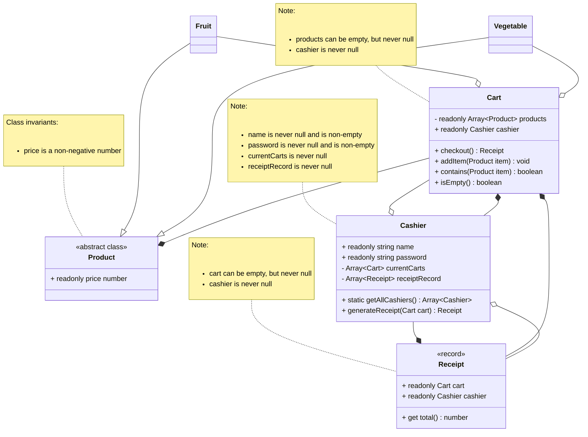

# Domain model

Some more information about these domain objects:
1. A Product can be of two types: Fruit and Vegetable. A product also has a price. The price is implied by the total cost on the receipt.
2. Cart is just a wrapper for an array (list in java) that stores products and provides limited functionality/usage of this array. In reality, you might also want to remove items from the cart, but the project description says nothing of the sort, MVP.
3. Receipt contains a reference to the cart. We can generate a summary of all the items in the cart and their quantities. We can also access the total price for all the items in the cart. In reality, we also have other details such as date, applied ongoing discounts etc., but we won't implement them for now, MVP.
4. We don't define checking properties against null since typescript does not need that assertion.
5. The receipt object does not need a summarize() method because I intend to treat the receipt class similar to a java object. It is only supposed to store a 'snapshot' of the cart once the checkout process is initialized. The receipt object itself is supposed to be the summary of cart. Receipt-View will be responsible for the exact details of how a receipt is shown on screen.

Changelog:
1. Price for all products is now a readonly variable
2. Receipt now has an updated invariant to check for empty carts
3. Cart has no invariants except being non-null
4. Product class itself is now responsible for validating and maintaining a correct price, fruit and vegetable only call super(price)
5. Fruit and Vegetable now don't store the price constant themselves. They only extend the product class and call it's constructor :)

6. Improved the tests to appropriately test the domain model given the current changes