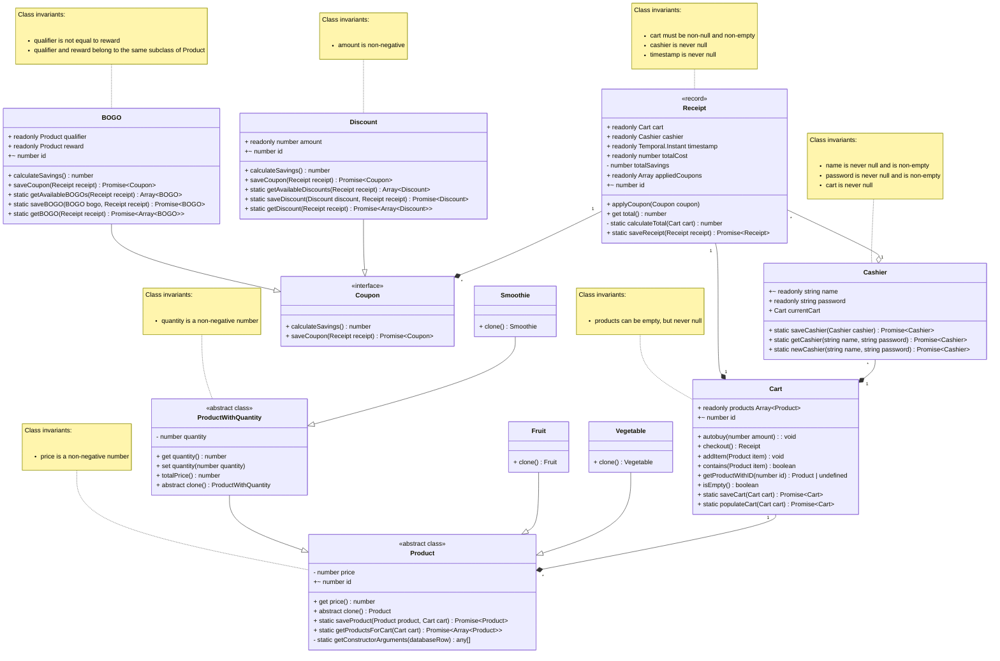

# Domain model

Comments for Design:

1. Product subclasses (i.e., Fruit) do not have any properties of their own, they only initialize the Product superclass and clone themselves when needed.
2. BOGO and Discount have different properties and different tables in the database. To save an instance of a BOGO or a Discount while adhering to OCP, I had to define the saveCoupon method in the Coupon interface that leaves specific persisting details to the implementations.
3. A receipt is supposed to store a snapshot of the current cart in the system. To enforce this design decision, receipts are only persisted into the database after checkout is complete. A (perhaps positive) side-effect of this is that during receipt-view (after 'Proceed to Checkout' button is clicked) if the page is refreshed, no receipts are uselessly persisted into the database when the checkout process was not fully finished. I have also decided to not provide an option for backing out of the receipt-view for simplicity.
4. The Cashier class has two seemingly 'identical' methods called getCashier and newCashier. The difference of these lies in the usage and error communication (feedback). The getCashier method is only used when a cashier tries to log in to the system, the assumption going into this method is that the cashier credentials would exist in the database. Hence a valid error state is not finding the given cashier and/or a password mismatch. The newCashier method is only used when a new cashier instance is being added to the system, hence a valid error state is finding a cashier with the same 'unique' credential (name).