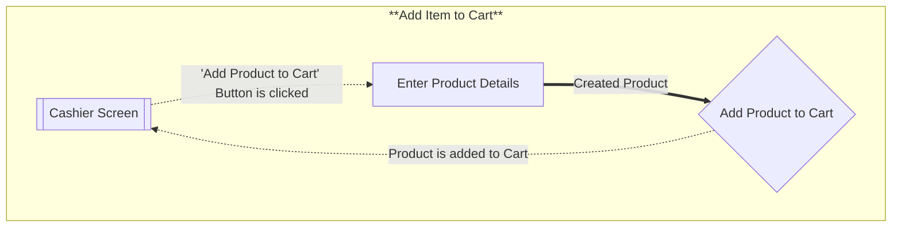
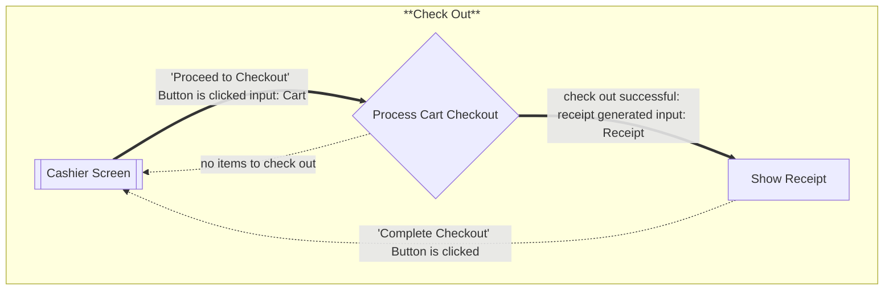

# Flows of interaction

## 1. Add Items

Show product details and add it to a cart for a customer.

## 2. Check Out

Check out and create a receipt summarizing the items purchased and their total cost.

Some more information about these flow of interactions:
1. A Cashier Screen is the main screen shown during the order building process (before check out but also not idle). It will show the cart so far (list of items scanned) and also an option to check out. In reality, we might also have the option to remove items from cart, but that is not described by the project description.
2. Viewing a product and adding it to cart has no error path. Once an item is scanned, it's details will be shown and it will be added to cart directly. There is no decision making/branching logic. We assume an infinite cart, it can never be fully filled.
3. Typically the check out behaviour is not defined for an empty cart, this is just a convention I have opted for.
4. Usually, some payment is required before completing check out and generating the receipt, but since the project description does not describe any payment processing/methods, we will stick to MVP.
5. Note that we always start at the Cashier Screen and no matter what task is performed, once completed, we return back to the Cashier Screen.

Changelog:
1. Updated the flow of interaction for Adding a product to cart. Main change was the 'Enter Product Detail' subtask which is responsible for creating the product.
2. Checkout Flow of Interaction is the same since the only 'change' comes after a checkout is completed. We reset the internal state of the app to the initial one so the cycle can be repeated from the 'Cashier Screen'.
3. We will only have a 'Confirm Checkout' button on the receipt pop up. I might add an option to cancel/go back in the future.