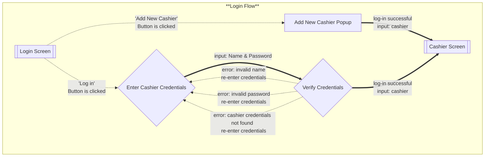
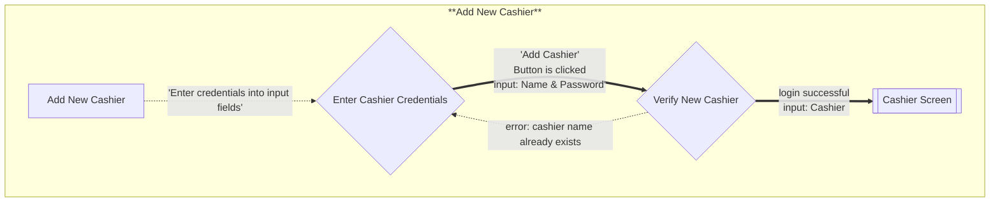
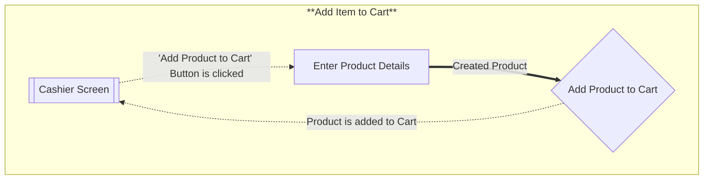
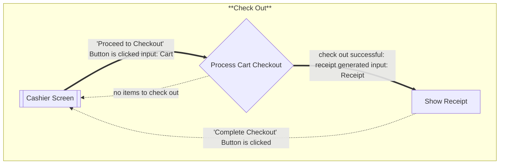
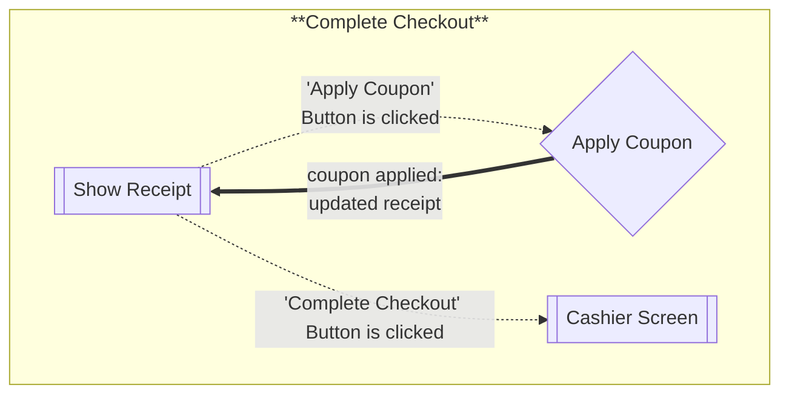
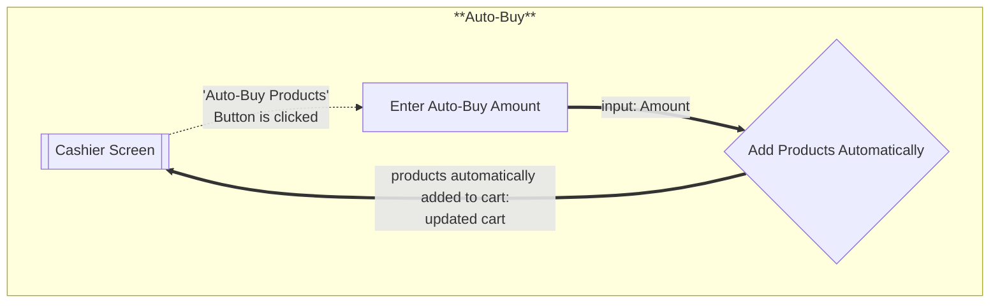

# Flows of interaction

## 1. Log-in

Enter cashier credentials and log-in.

## 2. Add New Cashier

Enter credentials for a new cashier and log-in.

## 3. Add Items to Cart

Enter product details and add it to cart for a cashier.

## 4. Check Out

Check out and create a receipt summarizing the items purchased and their total cost.

## 5. Show Receipt
Show an interactable receipt before order confirmation.

## 6. Auto-Buy
Automatically buys products for the user with the given amount.

Comments for Design:

1. A Cashier Screen is the main screen shown during the order building process (before check out but also not idle). It will show the cart so far (list of items scanned) and also an option to check out. In reality, we might also have the option to remove items from cart, but that is not described by the project description.
2. Viewing a product and adding it to cart has no error path. Once an item is scanned, it's details will be shown and it will be added to cart directly. There is no decision making/branching logic. We assume an infinite cart, it can never be fully filled.
3. Typically the check out behaviour is not defined for an empty cart, this is just a convention I have opted for.
4. After log-in, we always start at the Cashier Screen and no matter what task is performed, once completed, we return back to the Cashier Screen.
5. Note that the Log-in screen is the main screen shown whenever the website is loaded/refreshed.