# Phase 1

Here's my starting UI for phase 1:

## Phase 1 visibility

My initial implementation of this UI was minimally visible because:

* :-1: There was no welcome dialog or landing guidance screen on the cashier interface.
* :+1: The UI consisted mainly of two primary actions (add product to cart and checkout) which were both clearly visible.
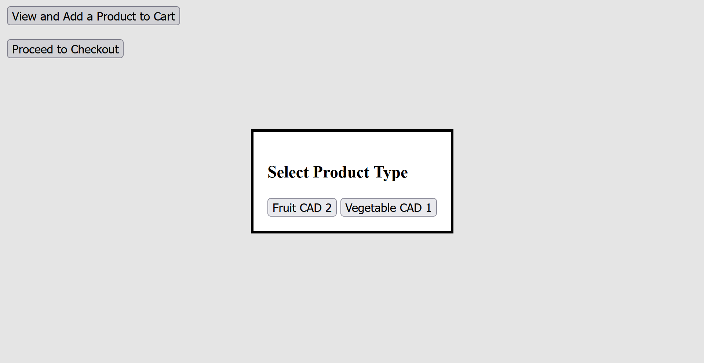

## Phase 1 feedback

My initial implementation of this UI had adequate feedback:

* :+1: The checkout process (especially in edge cases such as an empty cart) did clearly communicate system state and what was happening.
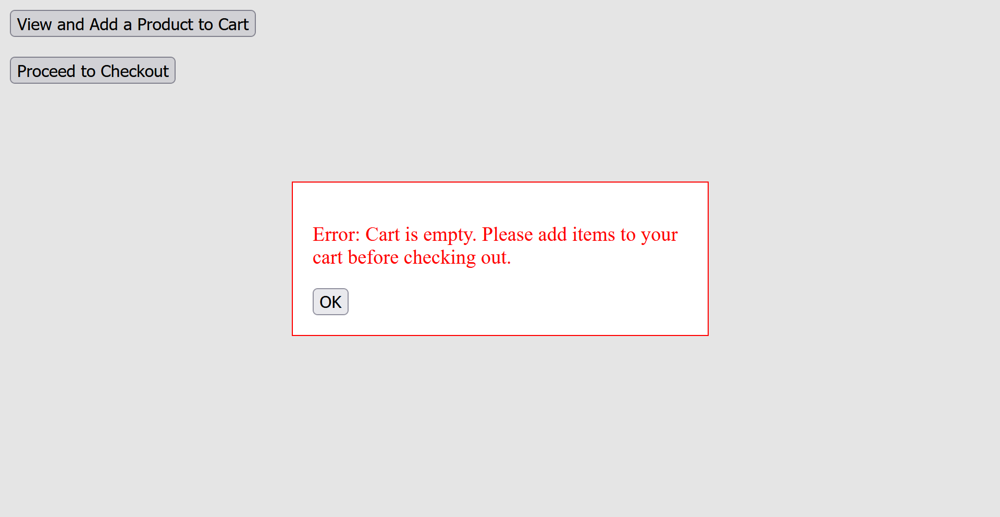
* :+1: The receipt screen clearly displayed the items in the cart along with a total.
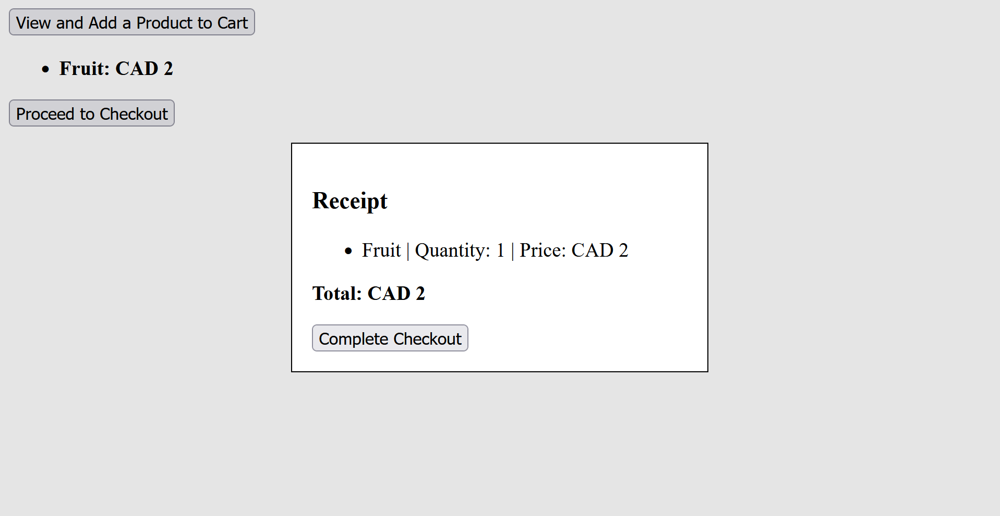

## Phase 1 consistency

My initial implementation of this UI looked terrible, but had good consistency:

* :+1: All buttons in the app were consistent and used only text-based labels.
* :+1: The two main operations were consistently placed across the UI.
* :+1: Inputs and interactions followed a uniform design pattern across screens.

# Phase 2

Here are the major new parts of my interface for phase 2:

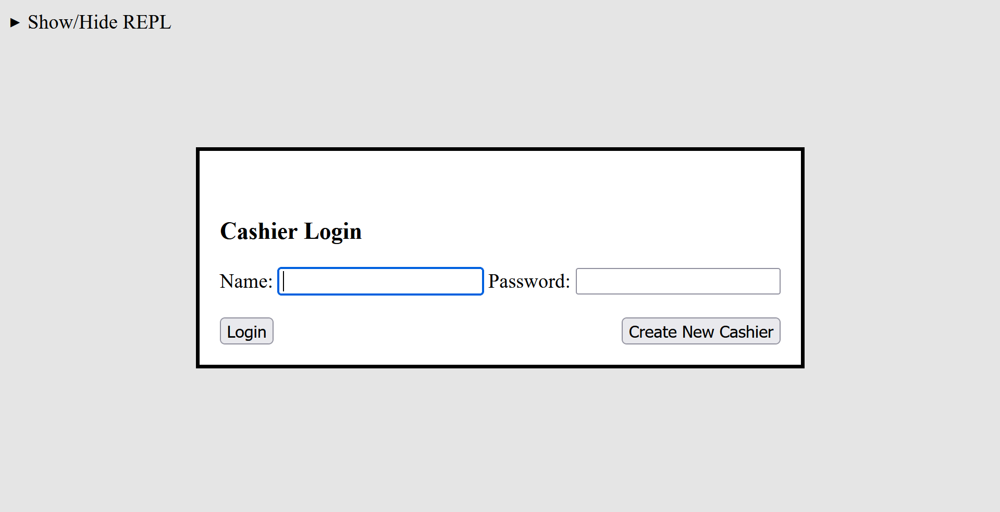

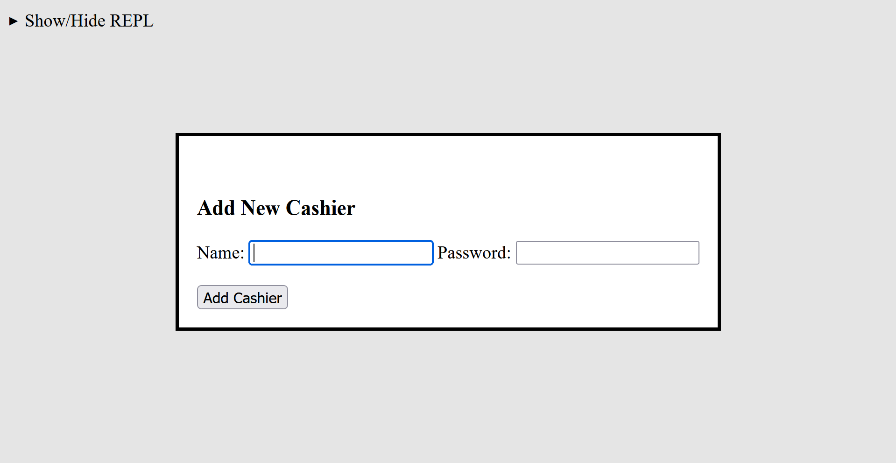

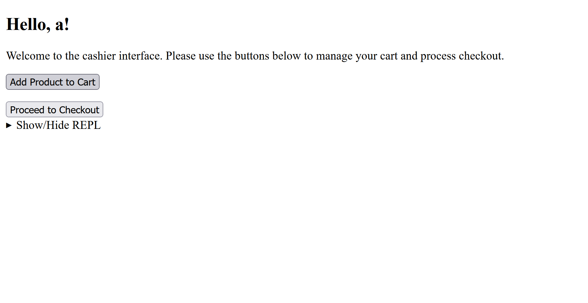

## Phase 2 visibility

My UI became more visible and self-explanatory in phase 2:

* :+1: A welcome message was added to the cashier screen, improving clarity of system operations.
* :+1: Login and signup screens were introduced, which made login and signup operations visible.
* :+1: Database REPL interaction is also visible.

## Phase 2 feedback

My UI improved feedback quality significantly in phase 2:

* :+1: Login failures (wrong password or non-existent user) now provide clear and immediate feedback.
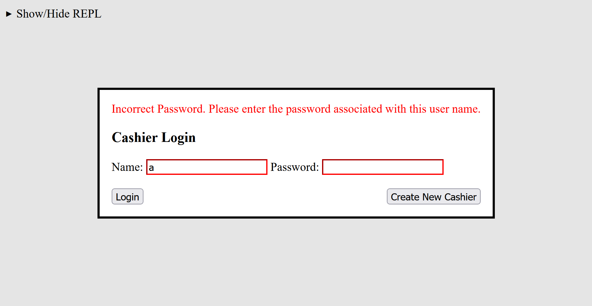
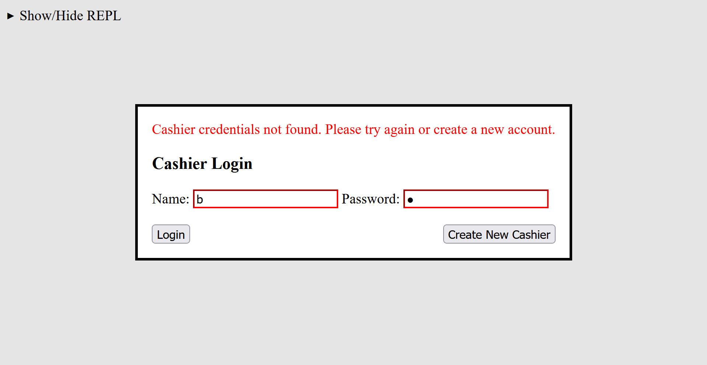
* :+1: Signup feedback clearly indicates when a user with the entered name already exists.
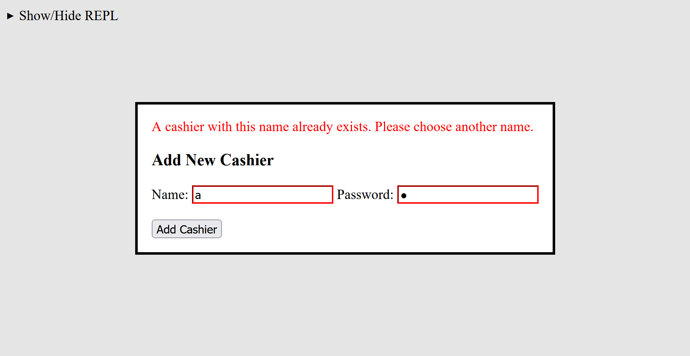

## Phase 2 consistency

My UI became more consistent in structure but introduced some inconsistencies in pricing logic:

* :+1: Navigation flows between login, signup, product selection, and cashier screens are consistent and predictable.
* :+1: Button-based interactions remain consistent across all screens and follow the same interaction pattern as Phase 1.
* :-1: Pricing logic is inconsistent across similar products (e.g., smoothies have inconsistent pricing rules based on quantity).
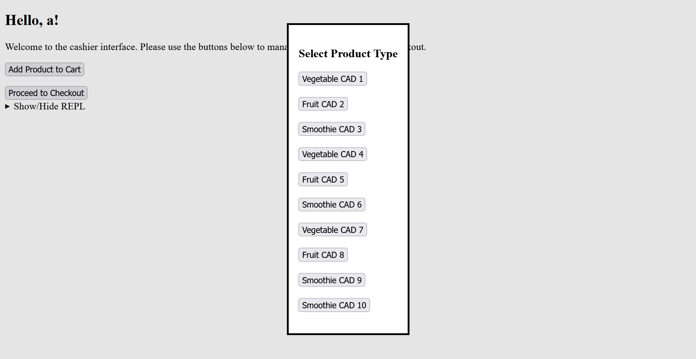
* :+1: Coupon application uses the same interaction pattern as product selection, maintaining consistency in user flow.
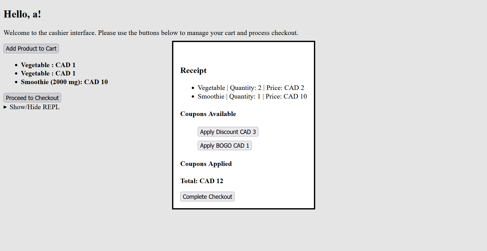

# Phase 3

Here are the major new parts of my interface for phase 3:

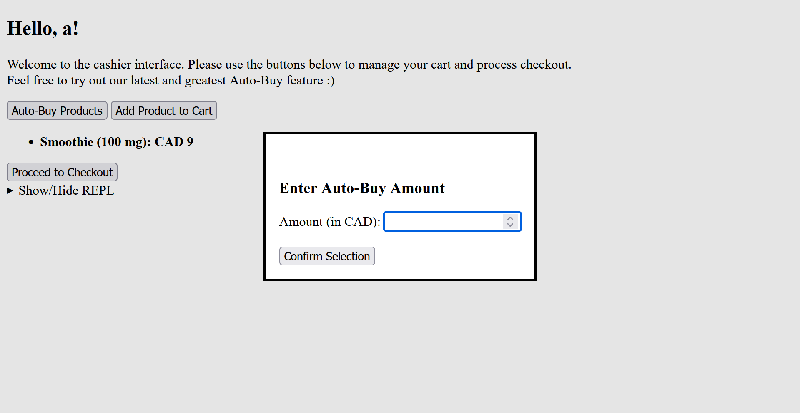

## Phase 3 visibility

My UI further improved visibility in phase 3:

* :+1: The auto-buy feature is clearly visible and accessible directly from the cashier screen.
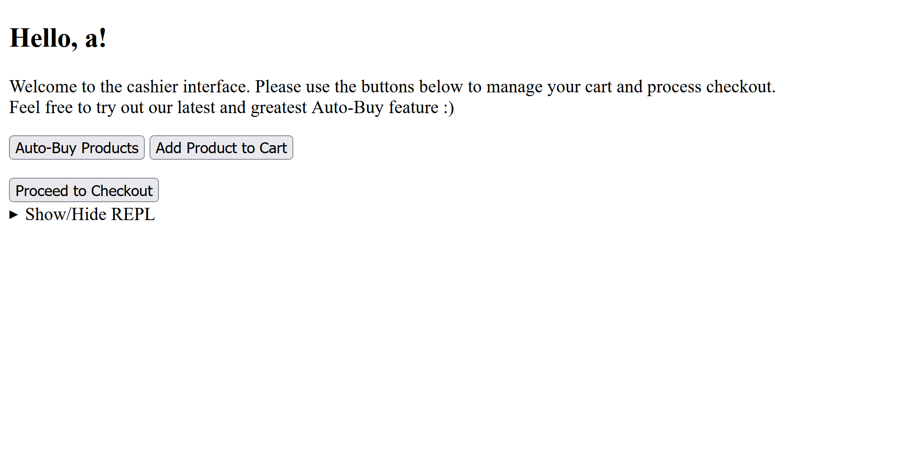

## Phase 3 feedback

My UI improved feedback handling in phase 3:

* :+1: The system clearly shows processing feedback when the auto-buy feature is running.
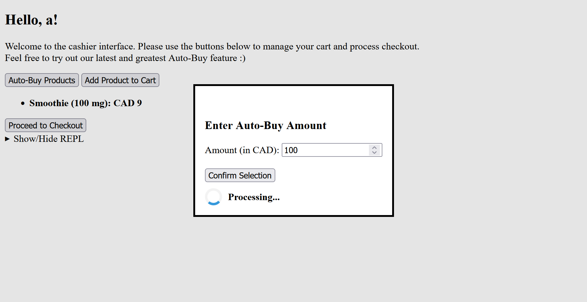

## Phase 3 consistency

My UI achieves the highest level of consistency in phase 3:

* :+1: Pricing for products with quantity is now consistent across all product types.
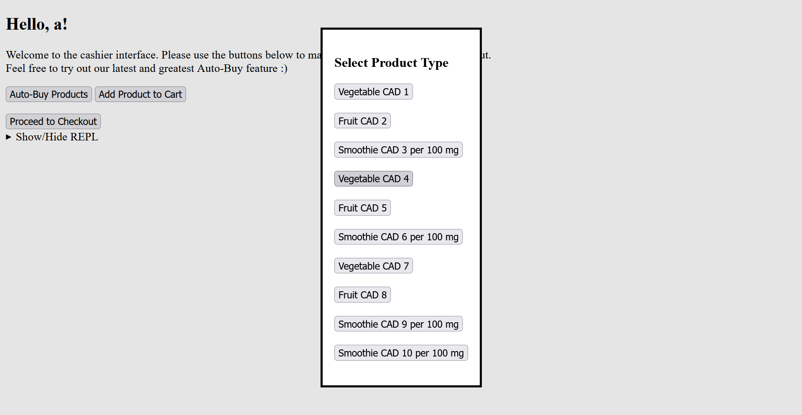
* :+1: The auto-buy input flow mirrors existing quantity input flow, maintaining consistent interaction design.
